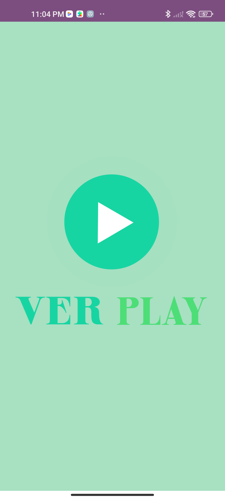
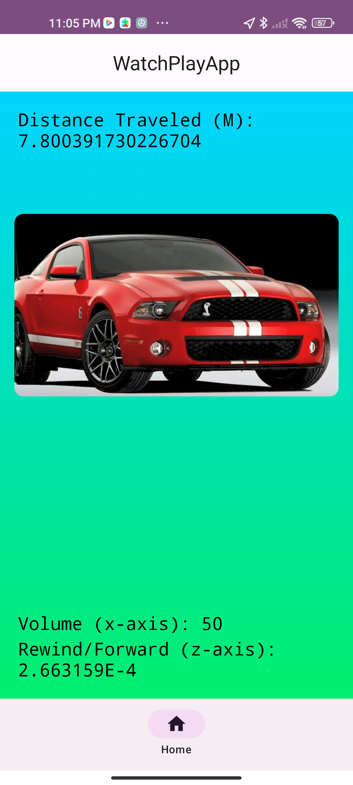

# Ver Play App - Coding Challenge

This App contains the following features : 

* Loading of Video by URL
* Replay of video by 10 meters of traveled distance
* Stop of video according to Shake !! Event
* Time control of video (Rewind and Forward) according to Z-AXIS
* Volume control of video according to X-AXIS

### Architecture

(Clean Architecture) + MVVM 

#### Layers

* App: UI.
* Presentation: View Models.
* UseCases
* RequestLocationManager
* SensorManager
* VideoPlayerManager

### External Libraries: 

* ExoPlayer
* Accompanist permissions
* Airbnb Lottie Animations

## Screenshots 

  
  

